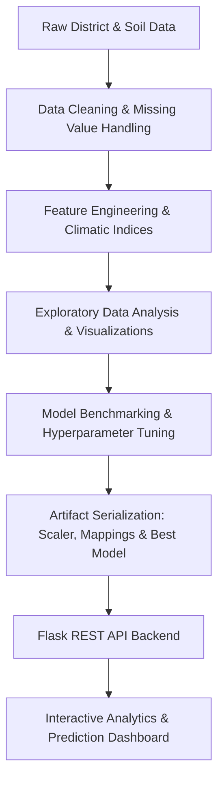

# 🌱 Indian Crop Production & Yield Prediction Pipeline

[](https://python.org)
[](https://flask.palletsprojects.com/)
[](https://scikit-learn.org/)
[](https://xgboost.ai/)
[](https://lightgbm.readthedocs.io/)
[](LICENSE)

An end-to-end Machine Learning and Data Science pipeline for analyzing, modeling, and predicting agricultural crop production across Indian districts based on soil characteristics, meteorological factors, and regional geospatial attributes.

---

## 📌 Project Highlights

- **Comprehensive EDA & Geospatial Analysis**: Exploratory analysis of agricultural patterns across Indian states and districts, assessing soil nutrient levels (N, P, K, Organic Carbon, pH) and climatic indicators (temperature, humidity, rainfall, sunshine hours).
- **Ensemble ML Benchmark**: Comparative evaluation of multiple machine learning models including **LightGBM**, **XGBoost**, **Random Forest**, **Decision Trees**, **SVR**, and **Linear Regression**.
- **High Predictive Accuracy**: Tuned ensemble models achieve $R^2 > 0.93$ with robust cross-validation and error diagnostics.
- **Interactive Web Dashboard**: Full-stack Flask + Glassmorphic UI featuring live yield estimation, district-level benchmarks, climatic correlation analysis, and feature importance profiling.

---

## 🏗️ Architecture & Pipeline Overview



---

## 📊 Dataset & Features

The dataset (`India_Districts_Crop_Production_Processed.csv`) aggregates multidimensional agricultural data:

| Feature Category | Features Included |
|------------------|-------------------|
| **Geographic**   | State, District, Latitude, Longitude |
| **Soil Chemistry** | Nitrogen (kg/ha), Phosphorus (kg/ha), Potassium (kg/ha), Organic Carbon (%), Soil pH |
| **Meteorological** | Temperature (°C), Relative Humidity (%), Precipitation (mm), Sunshine Hours |
| **Target Variable** | Crop Production (Metric Tonnes / Yield Index) |

---

## 🤖 Model Comparison & Benchmark

| Model | $R^2$ Score | Adj. $R^2$ | RMSE | MAE |
|:------|:-----------:|:----------:|:----:|:---:|
| **LightGBM (Tuned)** | **0.9312** | **0.9310** | **0.5765** | **0.3284** |
| **XGBoost (Tuned)** | **0.9287** | **0.9285** | **0.5862** | **0.3351** |
| **Random Forest (Tuned)** | 0.9245 | 0.9243 | 0.6034 | 0.3310 |
| **Random Forest (Baseline)** | 0.9198 | 0.9196 | 0.6220 | 0.3412 |
| **Decision Tree (Tuned)** | 0.8785 | 0.8782 | 0.7660 | 0.3987 |
| **Decision Tree (Baseline)** | 0.8543 | 0.8540 | 0.8387 | 0.4326 |
| **SVR (RBF)** | 0.5821 | 0.5812 | 1.4204 | 0.9541 |
| **Linear Regression** | 0.1753 | 0.1735 | 1.9959 | 1.5872 |

---

## 📁 Repository Structure

```text
├── .gitignore
├── README.md
├── requirements.txt
├── India_Crop_Pipeline (1).ipynb          # Complete Data Science & ML Notebook
├── India_Districts_Crop_Production_Processed.csv # Processed Agricultural Dataset
├── app.py                                 # Flask Application & Inference API
├── run_notebook_cells.py                  # Headless Notebook Execution Helper
├── images/                                # Generated EDA & Evaluation Visualizations
│   ├── figure_01.png ... figure_15.png
├── saved_model/                           # Serialized Model Artifacts
│   ├── best_model.pkl                     # Production ML Estimator
│   ├── category_mappings.pkl              # Categorical Encodings
│   ├── model_metadata.pkl                 # Training Metadata & Feature Names
│   └── scaler.pkl                         # Fitted Standard Scaler
└── static/                                # Web Application UI
    ├── index.html                         # Responsive Dashboard Layout
    ├── style.css                          # Modern Glassmorphic Styles
    └── app.js                             # Interactive Charts & Live Predictor
```

---

## 🚀 Quick Start Guide

### 1. Clone the Repository
```bash
git clone https://github.com/TEXxOP/indian_crop_pipeline.git
cd indian_crop_pipeline
```

### 2. Set Up Virtual Environment & Dependencies
```bash
python -m venv venv
# On Windows:
venv\Scripts\activate
# On Linux/macOS:
source venv/bin/activate

pip install -r requirements.txt
```

### 3. Run the Dashboard
```bash
python app.py
```
Open your browser and navigate to `http://127.0.0.1:5000` to interact with the dashboard.

---

## 📈 Visualizations & Analytics

The pipeline produces 15 high-resolution analytical visual figures located in `images/`:
- **Figures 1–6**: State/District crop frequency, seasonal yield distributions, and feature correlation heatmaps.
- **Figures 7–12**: Spatial mapping, rainfall vs. production curves, and soil nutrient interaction profiles.
- **Figures 13–15**: ML residual plots, predicted vs. actual distributions, and model performance comparisons.

---

## 📜 License

This project is licensed under the MIT License — see the [LICENSE](LICENSE) file for details.
